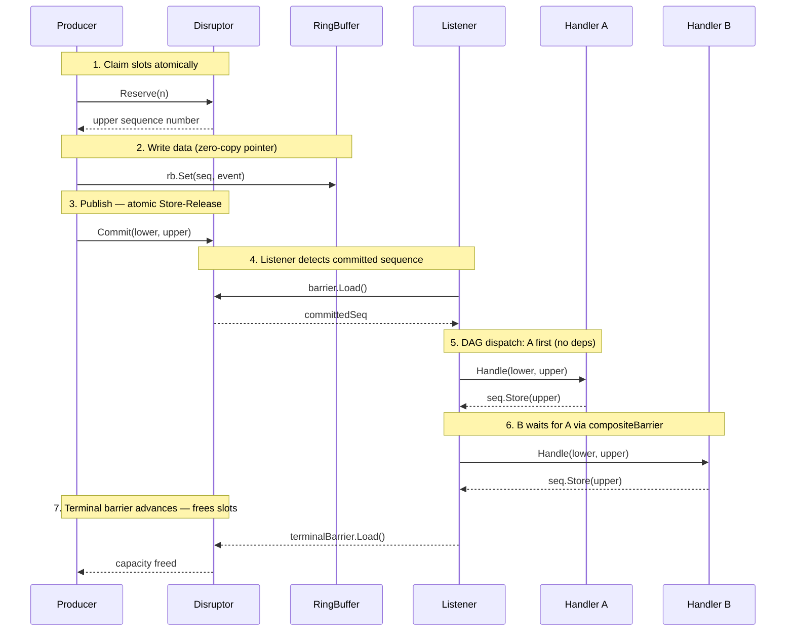

<p align="center">
  
</p>

<p align="center">
  <b>High-performance lock-free Disruptor for Go</b>
</p>

<p align="center">
  
  
  
</p>

<p align="center">
  <a href="README_zh.md">中文</a>&nbsp;&nbsp;|&nbsp;&nbsp;<b>English</b>
</p>

---

## What is seqflow

The [LMAX Disruptor](https://github.com/LMAX-Exchange/disruptor) is a high-performance inter-thread messaging framework born in the financial trading world. Its core idea: **everything is driven by sequences** — producers claim slots by advancing a sequence number, consumers read data by tracking that number. No locks, no queues, just atomic progression of integers.

**seqflow** = **Seq**uence-driven **Flow**. A Go implementation of the Disruptor pattern with mechanism-level optimizations for Go's runtime.

## How it Works



## Install

```bash
go get github.com/gocronx/seqflow
```

## Benchmark

> Apple M4 / darwin arm64 / Go 1.22+ / 0 allocs across all tests

### Single Writer

| Scenario | seqflow | channel | Speedup |
|:---------|--------:|--------:|:-------:|
| 1 slot per op | **2.1 ns** | 21 ns |  |
| 16 slots per op | **0.13 ns** | 22 ns/msg |  |

### Multi Writer (4 goroutines)

| Scenario | seqflow | channel | Speedup |
|:---------|--------:|--------:|:-------:|
| 1 slot per op | **39 ns** | 100 ns |  |
| 16 slots per op | **2.3 ns** | 103 ns/msg |  |

> **Why is batch so fast?** `Reserve(16)` claims 16 slots with a single atomic operation. Channel must send 16 times — 16 lock acquisitions.

<details>
<summary>Raw output</summary>

```
BenchmarkSeqflow_SingleWriter_Reserve1-10       2.131 ns/op    0 B/op    0 allocs/op
BenchmarkSeqflow_SingleWriter_Reserve16-10      0.1341 ns/op   0 B/op    0 allocs/op
BenchmarkSeqflow_MultiWriter4_Reserve1-10       38.58 ns/op    0 B/op    0 allocs/op
BenchmarkSeqflow_MultiWriter4_Reserve16-10      2.306 ns/op    0 B/op    0 allocs/op
BenchmarkChannel_SingleWriter-10                21.45 ns/op    0 B/op    0 allocs/op
BenchmarkChannel_SingleWriter_Batch16-10        355.3 ns/op    0 B/op    0 allocs/op  (22.2 ns/msg)
BenchmarkChannel_MultiWriter4-10                100.5 ns/op    0 B/op    0 allocs/op
BenchmarkChannel_MultiWriter4_Batch16-10        1649 ns/op     0 B/op    0 allocs/op  (103 ns/msg)
```

</details>

## Quick Start

```go
d, _ := seqflow.New[Event](
    seqflow.WithCapacity(1024),
    seqflow.WithHandler("decode", decodeHandler),
    seqflow.WithHandler("process", processHandler, seqflow.DependsOn("decode")),
    seqflow.WithHandler("store", storeHandler, seqflow.DependsOn("process")),
)

go d.Listen()

rb := d.RingBuffer()
for i := int64(0); i < 10; i++ {
    upper, _ := d.Reserve(1)
    rb.Set(upper, Event{Value: i})
    d.Commit(upper, upper)
}

d.Drain(ctx)
```

## Concepts

| | |
|---|---|
| **RingBuffer[T]** | Generic ring buffer. Power-of-2 capacity. `Get()` returns pointer (zero-copy). |
| **Reserve / Commit** | Producer claims slots, writes data, then commits. Visible to consumers after commit. |
| **Handler** | Consumer callback. Receives `(lower, upper)` sequence range for batch processing. |
| **DAG Topology** | Declare dependencies between handlers. Supports pipelines, diamonds, fan-out — any DAG. |

```
Producer → [A] → [B] → [D]
                → [C] ↗
```

```go
seqflow.WithHandler("A", h1),
seqflow.WithHandler("B", h2, seqflow.DependsOn("A")),
seqflow.WithHandler("C", h3, seqflow.DependsOn("A")),
seqflow.WithHandler("D", h4, seqflow.DependsOn("B", "C")),
```

## Examples

| Example | Description |
|---------|-------------|
| [basic](example/basic) | Single producer, single consumer |
| [batch](example/batch) | Batch reserve — claim 16 slots in one atomic op |
| [multiwriter](example/multiwriter) | 4 concurrent producers with shared sequencer |
| [diamond](example/diamond) | DAG: decode → risk + calc → store |
| [fanout](example/fanout) | Fan-out: one event → 3 independent consumers |
| [metrics](example/metrics) | Custom metrics collector |

```bash
go run github.com/gocronx/seqflow/example/basic
```

## Options

| Option | Description | Default |
|--------|-------------|---------|
| `WithCapacity(n)` | Buffer size (power of 2) | 1024 |
| `WithWriterCount(n)` | Concurrent writers. >1 enables shared sequencer | 1 |
| `WithWaitStrategy(s)` | Backpressure strategy | `SleepingStrategy` |
| `WithMetrics(m)` | Optional metrics collector | nil |

### Wait Strategies

| Strategy | Latency | CPU | Use case |
|----------|---------|-----|----------|
| `BusySpinStrategy` | Lowest | Highest | Dedicated cores |
| `YieldingStrategy` | Low | Medium | Shared CPU |
| `SleepingStrategy` | Medium | Low | **Default** |
| `BlockingStrategy` | High | Lowest | Low-frequency |

## Shutdown

```go
d.Close()    // stop immediately
d.Drain(ctx) // drain remaining events, then stop
```

Mutually exclusive. Second call returns `ErrClosed`.

## Design

- **Single package** — no cross-package interface dispatch overhead
- **Cache-line padding** — atomic sequences aligned to CPU cache lines, prevents false sharing
- **Pre-computed remaining capacity** — Reserve fast path: 1 comparison + 2 add/sub
- **Zero interface dispatch** — single-writer fields embedded directly in Disruptor struct
- **Zero atomic loads on fast path** — Close poisons capacity counter, no `atomic.Load` in hot loop
- **Optional metrics** — nil check in hot path, zero overhead when disabled
