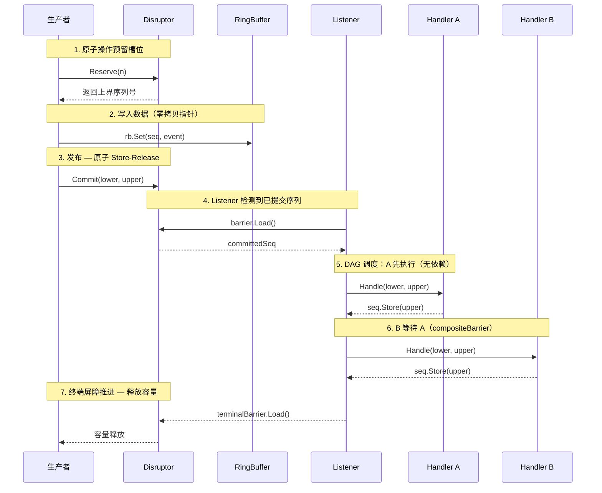

<p align="center">
  
</p>

<p align="center">
  <b>高性能无锁 Disruptor，Go 实现</b>
</p>

<p align="center">
  
  
  
</p>

<p align="center">
  <b>中文</b>&nbsp;&nbsp;|&nbsp;&nbsp;<a href="README.md">English</a>
</p>

---

## 什么是 seqflow

[LMAX Disruptor](https://github.com/LMAX-Exchange/disruptor) 是金融交易领域诞生的高性能并发框架，核心思想：**用序列号驱动一切** —— 生产者通过递增序列号预留槽位，消费者通过追踪序列号获取数据。不用锁，不用队列，全靠序列号的原子推进。

**seqflow** = **Seq**uence-driven **Flow**（序列驱动流）。它是 Disruptor 模式的 Go 实现，并在机制层面做了针对 Go 运行时的深度优化。

## 工作原理



## 安装

```bash
go get github.com/gocronx/seqflow
```

## 性能

> Apple M4 / darwin arm64 / Go 1.22+ / 全部零内存分配

### 单写者

| 场景 | seqflow | channel | 提升 |
|:-----|--------:|--------:|:----:|
| 每次 1 槽位 | **2.1 ns** | 21 ns |  |
| 每次 16 槽位 | **0.13 ns** | 22 ns/条 |  |

### 多写者（4 goroutine）

| 场景 | seqflow | channel | 提升 |
|:-----|--------:|--------:|:----:|
| 每次 1 槽位 | **39 ns** | 100 ns |  |
| 每次 16 槽位 | **2.3 ns** | 103 ns/条 |  |

> **为什么批量这么快？** `Reserve(16)` 用一次原子操作预留 16 个槽位。channel 必须发送 16 次 —— 16 次锁竞争。

<details>
<summary>原始输出</summary>

```
BenchmarkSeqflow_SingleWriter_Reserve1-10       2.131 ns/op    0 B/op    0 allocs/op
BenchmarkSeqflow_SingleWriter_Reserve16-10      0.1341 ns/op   0 B/op    0 allocs/op
BenchmarkSeqflow_MultiWriter4_Reserve1-10       38.58 ns/op    0 B/op    0 allocs/op
BenchmarkSeqflow_MultiWriter4_Reserve16-10      2.306 ns/op    0 B/op    0 allocs/op
BenchmarkChannel_SingleWriter-10                21.45 ns/op    0 B/op    0 allocs/op
BenchmarkChannel_SingleWriter_Batch16-10        355.3 ns/op    0 B/op    0 allocs/op  (22.2 ns/条)
BenchmarkChannel_MultiWriter4-10                100.5 ns/op    0 B/op    0 allocs/op
BenchmarkChannel_MultiWriter4_Batch16-10        1649 ns/op     0 B/op    0 allocs/op  (103 ns/条)
```

</details>

## 快速开始

```go
d, _ := seqflow.New[Event](
    seqflow.WithCapacity(1024),
    seqflow.WithHandler("decode", decodeHandler),
    seqflow.WithHandler("process", processHandler, seqflow.DependsOn("decode")),
    seqflow.WithHandler("store", storeHandler, seqflow.DependsOn("process")),
)

go d.Listen()

rb := d.RingBuffer()
for i := int64(0); i < 10; i++ {
    upper, _ := d.Reserve(1)
    rb.Set(upper, Event{Value: i})
    d.Commit(upper, upper)
}

d.Drain(ctx)
```

## 核心概念

| | |
|---|---|
| **RingBuffer[T]** | 泛型环形缓冲区，容量 2 的幂。`Get()` 返回指针，零拷贝。 |
| **Reserve / Commit** | 生产者先预留槽位，写入数据，再提交。提交后消费者可见。 |
| **Handler** | 消费者回调，接收序列范围 `(lower, upper)`，批量处理。 |
| **DAG 拓扑** | 消费者之间声明依赖，支持流水线、菱形、扇出等任意有向无环图。 |

```
Producer → [A] → [B] → [D]
                → [C] ↗
```

```go
seqflow.WithHandler("A", h1),
seqflow.WithHandler("B", h2, seqflow.DependsOn("A")),
seqflow.WithHandler("C", h3, seqflow.DependsOn("A")),
seqflow.WithHandler("D", h4, seqflow.DependsOn("B", "C")),
```

## 示例

| 示例 | 说明 |
|------|------|
| [basic](example/basic) | 单生产者，单消费者 |
| [batch](example/batch) | 批量预留 — 一次原子操作预留 16 个槽位 |
| [multiwriter](example/multiwriter) | 4 个生产者并发写入 |
| [diamond](example/diamond) | DAG 菱形：解码 → 风控 + 计算 → 落库 |
| [fanout](example/fanout) | 扇出：一个事件 → 3 个独立消费者 |
| [metrics](example/metrics) | 自定义指标收集器 |

```bash
go run github.com/gocronx/seqflow/example/basic
```

## 配置

| 选项 | 说明 | 默认值 |
|------|------|--------|
| `WithCapacity(n)` | 缓冲区大小（必须 2 的幂） | 1024 |
| `WithWriterCount(n)` | 并发写者数，>1 启用多写者模式 | 1 |
| `WithWaitStrategy(s)` | 等待策略 | `SleepingStrategy` |
| `WithMetrics(m)` | 可选指标收集 | nil |

### 等待策略

| 策略 | 延迟 | CPU | 场景 |
|------|------|-----|------|
| `BusySpinStrategy` | 极低 | 极高 | 独占核心 |
| `YieldingStrategy` | 低 | 中 | 共享 CPU |
| `SleepingStrategy` | 中 | 低 | **默认** |
| `BlockingStrategy` | 高 | 极低 | 低频场景 |

## 关闭

```go
d.Close()       // 立即停止
d.Drain(ctx)    // 排空后停止
```

互斥调用，重复调用返回 `ErrClosed`。

## 设计要点

- **单包设计** — 避免跨包接口调用开销
- **缓存行对齐** — 原子序列按 CPU 缓存行填充，防止 false sharing
- **预计算剩余容量** — Reserve 快路径仅 1 次比较 + 2 次加减
- **零接口分发** — 单写者字段直接嵌入 Disruptor 结构体
- **零原子读** — 关闭时毒化容量计数，快路径无 atomic 操作
- **Metrics 可选** — nil 时零开销
