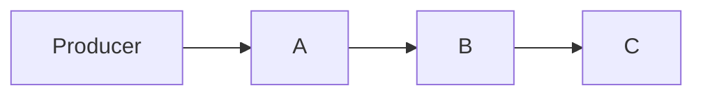
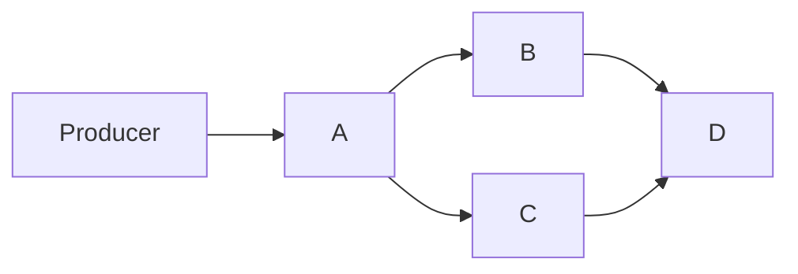
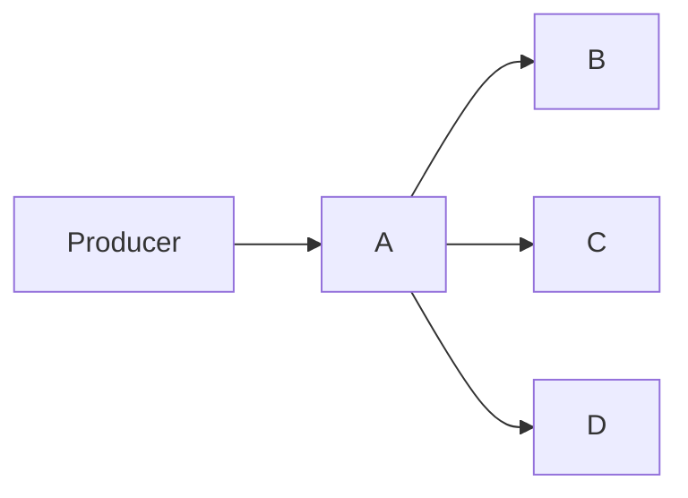

# DAG Consumer Topology

seqflow supports arbitrary directed acyclic graph (DAG) dependencies between handlers, not just linear pipelines.

## Linear Pipeline

```go
seqflow.WithHandler("A", handlerA),
seqflow.WithHandler("B", handlerB, seqflow.DependsOn("A")),
seqflow.WithHandler("C", handlerC, seqflow.DependsOn("B")),
```



A must finish before B starts. B must finish before C starts.

## Diamond

```go
seqflow.WithHandler("A", handlerA),
seqflow.WithHandler("B", handlerB, seqflow.DependsOn("A")),
seqflow.WithHandler("C", handlerC, seqflow.DependsOn("A")),
seqflow.WithHandler("D", handlerD, seqflow.DependsOn("B", "C")),
```



B and C run in parallel after A. D waits for both B and C.

## Fan-out

```go
seqflow.WithHandler("A", handlerA),
seqflow.WithHandler("B", handlerB, seqflow.DependsOn("A")),
seqflow.WithHandler("C", handlerC, seqflow.DependsOn("A")),
seqflow.WithHandler("D", handlerD, seqflow.DependsOn("A")),
```



B, C, D all run independently in parallel after A.

## Independent (no dependencies)

```go
seqflow.WithHandler("logger", logHandler),
seqflow.WithHandler("monitor", monitorHandler),
seqflow.WithHandler("archive", archiveHandler),
```

All three process the same events independently. Each gets every event.

## How It Works

- Each handler has an independent sequence tracking its progress
- `DependsOn` creates a composite barrier from dependency sequences
- A handler can only advance to the minimum position of all its dependencies
- Terminal handlers (not referenced by any `DependsOn`) gate the producer
