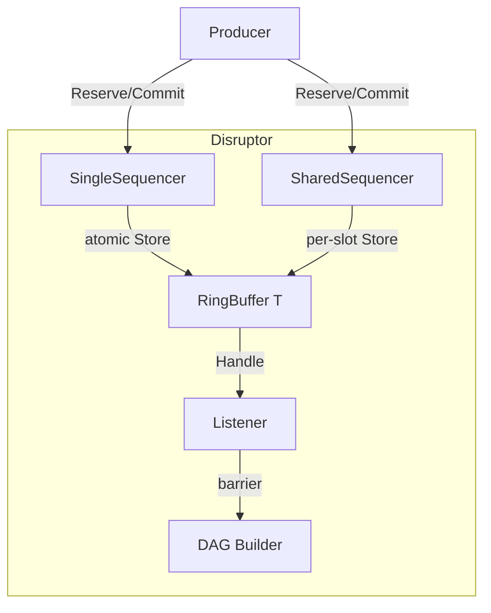

# Design

## Architecture

Single package, no external dependencies. All components in one package to avoid cross-package interface call overhead.

## Sequence

Cache-line padded `atomic.Int64`. Prevents false sharing between CPU cores.

Platform-specific padding:
- 32 bytes: ARM, MIPS
- 64 bytes: x86, AMD64, RISC-V
- 128 bytes: Apple Silicon, PowerPC
- 256 bytes: s390x

## Single vs Multi Writer

**SingleSequencer** (WriterCount=1): No atomic operations on Reserve fast path. Plain `int64` increment + cached consumer check.

**SharedSequencer** (WriterCount>1): Uses `atomic.Add` for slot claiming. Per-slot round tracking (`committedSlots []atomic.Int32`) enables out-of-order commits from concurrent writers.

## Barrier System

- **atomicBarrier** — tracks single upstream sequence
- **compositeBarrier** — returns minimum of multiple sequences (slowest consumer)

Used to coordinate between handler groups in DAG topologies.

## Graceful Shutdown

- `Close()` — immediate stop, poisons `remainingCapacity` to -1
- `Drain(ctx)` — polls `terminalBarrier` until all consumers catch up to `committedSeq`, then closes

Both are mutually exclusive terminal operations.
