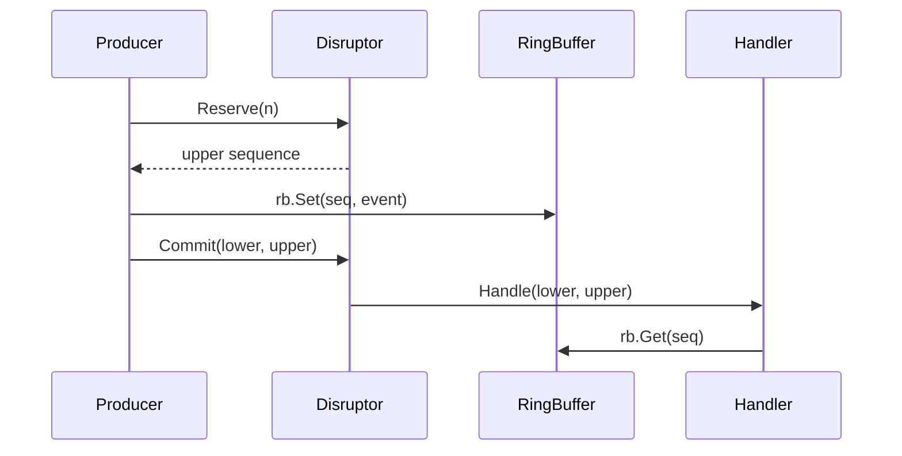

# Getting Started

## Install

```bash
go get github.com/gocronx/seqflow
```

Requires Go 1.22+.

## Basic Example

```go
package main

import (
    "context"
    "fmt"
    "time"

    "github.com/gocronx/seqflow"
)

type Event struct {
    Value int64
}

type printer struct{}

func (p *printer) Handle(lower, upper int64) {
    fmt.Printf("processed sequences %d..%d\n", lower, upper)
}

func main() {
    d, err := seqflow.New[Event](
        seqflow.WithCapacity(1024),
        seqflow.WithHandler("printer", &printer{}),
    )
    if err != nil {
        panic(err)
    }

    go d.Listen()

    rb := d.RingBuffer()
    for i := int64(0); i < 10; i++ {
        upper, _ := d.Reserve(1)
        rb.Set(upper, Event{Value: i})
        d.Commit(upper, upper)
    }

    ctx, cancel := context.WithTimeout(context.Background(), time.Second)
    defer cancel()
    d.Drain(ctx)
}
```

## How It Works

1. **Reserve** — producer claims slots in the ring buffer atomically
2. **Write** — producer writes data to the claimed slots via `RingBuffer.Set()`
3. **Commit** — producer publishes the data (atomic Store-Release)
4. **Handle** — consumer receives a batch of sequences `(lower, upper)` and processes them


