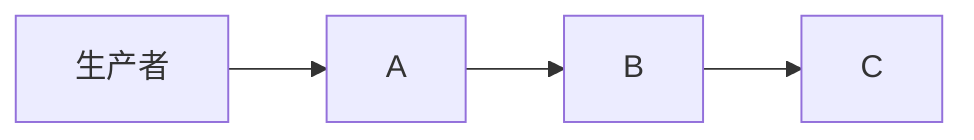
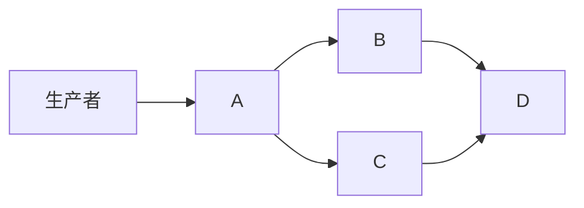
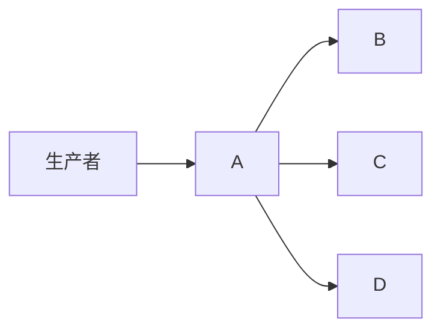

# DAG 消费者拓扑

seqflow 支持任意有向无环图（DAG）依赖关系。

## 线性流水线

```go
seqflow.WithHandler("A", handlerA),
seqflow.WithHandler("B", handlerB, seqflow.DependsOn("A")),
seqflow.WithHandler("C", handlerC, seqflow.DependsOn("B")),
```



## 菱形

```go
seqflow.WithHandler("A", handlerA),
seqflow.WithHandler("B", handlerB, seqflow.DependsOn("A")),
seqflow.WithHandler("C", handlerC, seqflow.DependsOn("A")),
seqflow.WithHandler("D", handlerD, seqflow.DependsOn("B", "C")),
```



B 和 C 在 A 完成后并行运行。D 等待 B 和 C 都完成。

## 扇出



B、C、D 在 A 之后独立并行运行。

## 独立（无依赖）

所有 handler 无依赖时，每个 handler 都会收到每条事件，独立并行处理。
